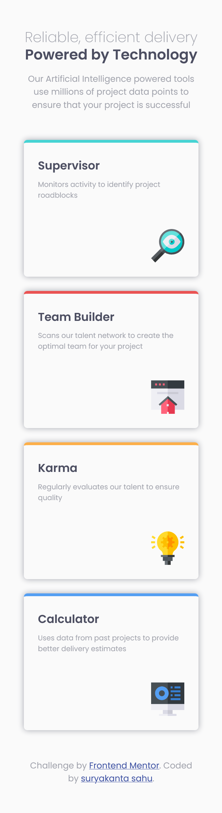
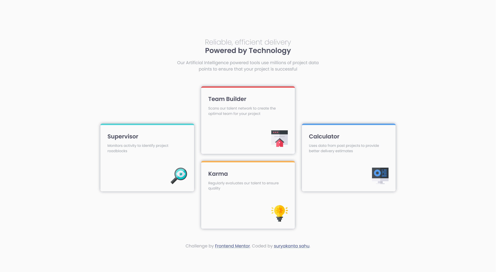

# Frontend Mentor - Four card feature section solution

This is a solution to the [Four card feature section challenge on Frontend Mentor](https://www.frontendmentor.io/challenges/four-card-feature-section-weK1eFYK). Frontend Mentor challenges help you improve your coding skills by building realistic projects. 

## Table of contents

- [Overview](#overview)
  - [The challenge](#the-challenge)
  - [Screenshot](#screenshot)
  - [Links](#links)
- [My process](#my-process)
  - [Built with](#built-with)
  - [What I learned](#what-i-learned)
  - [Continued development](#continued-development)

**Note: Delete this note and update the table of contents based on what sections you keep.**

## Overview

### The challenge

Users should be able to:

- View the optimal layout for the site depending on their device's screen size

### Screenshot

- mobile screenshot



-desktop screenshot




### Links

- Solution URL: [Add solution URL here](https://your-solution-url.com)
- Live Site URL: [Add live site URL here](https://your-live-site-url.com)

## My process

### Built with

- Semantic HTML5 markup
- CSS custom properties
- CSS Grid
- Mobile-first workflow


### What I learned

learned how to use grid and place items in respective shells using grid-row and grid-column properties.

To see how you can add code snippets, see below:

```css
.sections{
    max-width: 1000px;
   grid-template-columns: repeat(3,1fr);
   grid-template-rows: repeat(4,1fr);
  }
  .section_item[data-item="supervisor"]{
    grid-column:  1/ span 1;
    grid-row:  2/ span 2;
  }
  .section_item[data-item="team_builder"]{
    grid-column:  2/ span 1;
    grid-row:  1/ span 2;
  }
  .section_item[data-item="karma"]{
    grid-column:  2/ span 1;
    grid-row:  3/ span 2;
  }
  .section_item[data-item="calculator"]{
    grid-column:  3/ span 1;
    grid-row:  2/ span 2;
  }
```

### Continued development

Use this section to outline areas that you want to continue focusing on in future projects. These could be concepts you're still not completely comfortable with or techniques you found useful that you want to refine and perfect.

**Note: Delete this note and the content within this section and replace with your own plans for continued development.**
